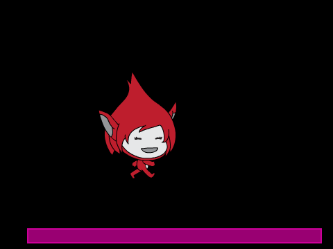
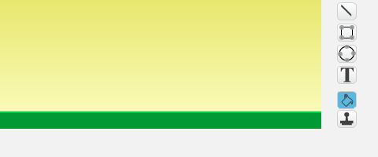

# Introduksjon {.intro}

Før Super Mario fikk sine egne spill het han Jumpman. I dette
prosjektet skal vi lage et Super Mario-lignende plattformspill. Det er
ganske involvert, og vi vil derfor dele opp prosjektet i fire deler
som til sammen blir et spennende spill.

I denne første delen skal vi fokusere på å sette opp en hovedløkke for
spillet vårt, samt se hvordan vi kan animere Jumpman på en ganske
snedig måte.



# Oversikt over prosjektet {.activity}

Dette prosjektet består av 4 deler hvor vi stadig videreutvikler
spillet vårt.

+ Dette er del 1 hvor vi vil programmere helten vår, Jumpman, og
  spesielt animere ham alt etter som om han står i ro, løper eller
  hopper.

+ I [del 2](jumpman_2_kollisjon.html) vil vi se hvordan vi kan oppdage
  at Jumpman berører forskjellige ting, og spesielt hvordan vi kan se
  forskjellen på om han hopper opp i en plattform eller står på toppen
  av den.

+ I [del 3](jumpman_3_skrolling.html) skal vi utvide verdenen vår ved
  å flytte på bakgrunnen. Vi vil da kunne løpe rundt og oppdage
  plattformer utenfor skjermen.

+ I [fjerde og siste del](jumpman_4_design.html) vil vi lære hvordan
  vi lager flere nivåer, samt hvordan vi kan inkludere elementer som
  smarte fiender og bevegelige plattformer.

# Steg 1: En kontrollerende figur {.activity}

*For å ha fleksibilitet i hvordan vi animerer Jumpman vil vi skille
 mellom hvordan figuren kontrolleres og hvordan den animeres.*

Dersom du allerede har gjort
[Donkey Kong](../donkey_kong/donkey_kong.html)-oppgaven vil du kjenne
igjen mye av koden vi utvikler i denne oppgaven. Bruk i såfall gjerne
ryggsekken for å kopiere inn koden du laget på hoppefiguren der, siden
du kan gjenbruke mye av koden (men en del vil også være forskjellig).

## Sjekkliste {.check}

+ Start et nytt prosjekt.

+ La kattefiguren bli værende (den vil ikke synes i det ferdige
  spillet), men gi den navnet `Kontroller`.

+ Tegn en farget linje nederst på bakgrunnen. I denne delen av
  prosjektet vil dette være plattformen Jumpman kan bevege seg rundt
  på.

  

For å styre hvordan spillet oppfører seg skal vi bruke en *hovedløkke*
som vil sende meldinger til alle figurene. Figurene velger så hvordan
de vil svare på meldingene.

+ Lag de følgende to skriptene på __Scenen__:

  ```blocks
      når grønt flagg klikkes
      send melding [nytt spill v]

      når jeg mottar [nytt spill v]
      send melding [startposisjon v]
      for alltid
          send melding [fysikk v]
          send melding [sjekk plattform v]
          send melding [sjekk tastetrykk v]
          send melding [flytt figurer v]
          send melding [vis animasjon v]
      slutt
  ```

  Hvis du leser gjennom meldingene ser du at vi har laget en liste
  over alt som må gjøres hver gang vi vil oppdatere spillet vårt.

+ Vi vil bruke variablene `(fartX)`{.b} og `(fartY)`{.b} for å
  kontrollere bevegelsen til Jumpman. Lag disse to variablene på
  `Kontroller`-figuren. La dem gjelde *kun for denne figuren*.

+ Nå kan vi se hvordan hovedløkken fungerer. Lag disse fire skriptene
  på `Kontroller`-figuren:

  ```blocks
      når jeg mottar [startposisjon v]
      gå til x: (-100) y: (-60)
      sett [fartX v] til [0]
      sett [fartY v] til [0]

      når jeg mottar [fysikk v]
      sett [fartX v] til [0]
      endre [fartY v] med (-0.5)

      når jeg mottar [sjekk plattform v]
      hvis (berører fargen [#009900]?)
          sett [fartY v] til [0]
      slutt

      når jeg mottar [flytt figurer v]
      endre x med (fartX)
      endre y med (fartY)
  ```

  Om du tester spillet ditt ved å klikke på det grønne flagget, skal
  du se at `Kontroller`-figuren faller ned til plattformen, og blir
  stående på den.

+ Dersom du allerede har gjort
  [Donkey Kong](../donkey_kong/donkey_kong.html)-oppgaven bør du
  sammenligne denne koden med slik vi skrev den der. Ser du at koden
  er den samme, men vi har organisert den litt annerledes? Når vi
  lager et større spill slik som dette er det enklere å holde oversikt
  når hvert skript er ganske lite og bare skal gjøre en ting!

# Steg 2: Animasjoner! {.activity}

*På tide å animere helten vår!*

Nå har vi laget en `Kontroller`-figur. Men vi sa tidligere at denne
figuren ikke vil synes i det ferdige spillet. Vi skal nemlig bruke
egne figurer for animasjon. På denne måten er det lett å bruke
forskjellige animasjoner når figuren står i ro, når den løper og når
den hopper.

## Sjekkliste {.check}

+ Lag en ny figur med flere drakter som animerer at den står i ro. Du
  kan gjerne tegne denne selv. Alternativt har for eksempel figurene
  `Fantasi/Giga` og `Fantasi/Pico` fine animasjoner. Gi figuren navnet
  `Animasjon - Stå`.

+ Lag en ny variabel, `(animasjon)`{.b}. Denne må gjelde *for alle
  figurer*. Denne skal vi bruke til å bestemme hvilken animasjon vi
  vil vise.

+ Legg til klossen `sett [animasjon v] til [stå]`{.b} inne i
  `hvis`{.blockcontrol}-testen i `sjekk plattform`-skriptet til
  `Kontroller`en. Det betyr at vi vil vise stå-animasjonen når figuren
  står på plattformen.

+ På `Animasjon - Stå`-figuren trenger vi bare et skript, nemlig det
  som viser figuren:

  ```blocks
      når jeg mottar [vis animasjon v]
      hvis ((animasjon) = [stå])
          pek i retning ([retning v] av [Kontroller v])
          sett x til ([x-posisjon v] av [Kontroller v])
          sett y til ([y-posisjon v] av [Kontroller v])
          neste drakt
          vis
      ellers
          skjul
      slutt
  ```

  Legg merke til hvordan vi kopierer posisjonen til
  `Kontroller`-figuren. Animasjonen gjøres veldig enkelt med bare en
  kloss, `neste drakt`{.b}.

+ Du kan endre animasjonen ved å legge til flere drakter. Et tips er
  at om du vil at animasjonen skal gå litt saktere kan du kopiere den
  samme drakten mange ganger. For eksempel kan en `stå`-animasjon
  bestå av mange av den samme drakten, og så kanskje noen få drakter
  hvor figuren smiler litt, flytter seg ørlite eller noe lignende.

+ Det er på tide vi skjuler `Kontroller`-figuren. Dessverre kan vi
  *ikke* bruke en `skjul`{.b}-kloss fordi da vil ikke
  `berører`{.blocksensing}-klossene fungere lenger. I stedet gjør vi
  figuren helt gjennomsiktig. Legg til dette skriptet på
  `Kontroller`-figuren:

  ```blocks
      når grønt flagg klikkes
      sett [gjennomsiktig v] effekt til (100)
      begrens rotasjon [vend sideveis v]
  ```

+ Legg til nye figurer, `Animasjon - Løp` og `Animasjon - Hopp`. For
  eksempel kan du bruke figurene `Fantasi/Giga walking` eller
  `Fantasi/Pico walking`. Du kan også tegne drakter selv.

+ Lag tilsvarende skript på de nye `Animasjon`-figurene. Det eneste du
  trenger å endre fra skriptet på `Animasjon - Stå`-figuren er
  `hvis`{.blockcontrol}-testen.

  Om du vil teste animasjonene kan du endre `sett [animasjon v] til
  [stå]`{.b}-klossen (men husk å endre tilbake når du er ferdig å
  teste).

# Steg 3: En hoppende helt {.activity}

*Vi har animert Jumpman, men han beveger seg ikke! Det må vi gjøre noe
 med.*

Vi skal nå skrive koden som får Jumpman til å bevege seg. Husk at all
denne koden skal være på `Kontroller`-figuren. Og du trenger *ingen
løkker* på `Kontroller` siden vi bruker *hovedløkken* til spillet.

## Sjekkliste {.check}

Vi skal nå skrive flere `hvis`{.blockcontrol}-tester på et nytt `når
jeg mottar [sjekk tastetrykk v]`{.b}-skript.

+ Først kan vi få Jumpman til å hoppe:

  ```blocks
      hvis ((berører fargen [#009900]?) og (tast [pil opp v] trykket?))
          sett [fartY v] til [5]
          sett [animasjon v] til [hopp]
      slutt
  ```

+ For at Jumpman skal løpe sidelengs vil vi snu figuren i riktig
  retning, og sette `(fartX)`{.b}-variabelen. For eksempel kan vi
  flytte ham mot høyre med en test som dette:

  ```blocks
      hvis (tast [pil høyre v] trykket?)
          pek i retning (90 v)
          sett [fartX v] til [5]
          hvis (berører fargen [#009900]?)
              sett [animasjon v] til [løp]
          slutt
      slutt
  ```

+ Legg selv til en `hvis`{.blockcontrol}-test for å flytte Jumpman mot
  venstre.

+ Prøv spillet ditt! Kan du løpe og hoppe rundt på plattformen?

  Du oppdager kanskje at Jumpman står på hodet når han løper mot
  venstre? Dette fikser du ved hjelp av `begrens rotasjon
  [vend sideveis v]`{.b}-kloss på hver av `Animasjon`-figurene.

# Steg 4: Videreutvikling av spillet {.activity}

*Vi har så langt bare laget grunnlaget for et spill. En animert figur
 som kan springe og hoppe rundt. I [del 2](jumpman_2_kollisjon.html)
 vil vi fortsette utviklingen av spillet. Men om du vil jobbe litt
 videre før den oppgaven kan du prøve noe av det følgende.*

## Ideer til videreutvikling {.check}

+ Prøv forskjellige verdier for `(fartX)`{.b} og `(fartY)`{.b} i
  `sjekk tastetrykk`-skriptet. Hvordan forandrer det oppførselen til
  Jumpman?

+ Hva med å legge til noen lyder? Korte, enkle lyder når Jumpman
  beveger seg kan passe. Og kanskje et lite rop når han hopper, eller
  en litt utålmodig *Hallo!* om han blir stående for lenge i ro? Husk
  at du kan ta opp egne lyder også, ikke bare bruke lydene som følger
  med Scratch.

+ Lag en forside til spillet. Om du lager en forside som forteller
  litt om hvordan man spiller spillet ditt blir det enklere for andre
  å spille det også!

+ Kan du legge til flere bevegelser som kan animeres? Kanskje Jumpman
  kan sette seg ned om du trykker nedoverpilen? Eller kanskje han kan
  ta en salto i luften eller gjøre et superhopp om man gjør de riktige
  tastaturkombinasjonene?
