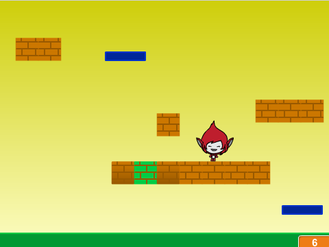
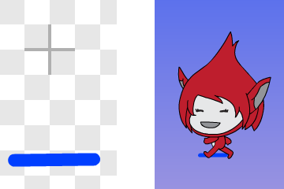

# Introduksjon {.intro}

Før Super Mario fikk sine egne spill het han Jumpman. I dette
prosjektet skal vi lage et Super Mario-lignende plattformspill. Det er
ganske involvert, og vi vil derfor dele opp prosjektet i fire deler
som til sammen blir et spennende spill.

I denne andre delen skal vi fokusere på hvordan vi kan gjøre avansert
kollisjonsdeteksjon, og blant annet merke forskjellen på om Jumpman
står på en plattform eller hopper opp i en plattform nedenfra.



# Oversikt over prosjektet {.activity}

Dette prosjektet består av 4 deler hvor vi stadig videreutvikler
spillet vårt.

+ I [del 1](jumpman_1_animasjon.html) programmerte vi helten vår,
  Jumpman, og spesielt animerte vi ham alt etter som om han stod i ro,
  løp eller hoppet.

+ I denne delen vil vi se hvordan vi kan oppdage at Jumpman berører
  forskjellige ting, og spesielt hvordan vi kan se forskjellen på om
  han hopper opp i en plattform eller står på toppen av den.

+ I [del 3](jumpman_3_skrolling.html) skal vi utvide verdenen vår ved
  å flytte på bakgrunnen. Vi vil da kunne løpe rundt og oppdage
  plattformer utenfor skjermen.

+ I [fjerde og siste del](jumpman_4_design.html) vil vi lære hvordan
  vi lager flere nivåer, samt hvordan vi kan inkludere elementer som
  smarte fiender og bevegelige plattformer.

# Steg 1: Sensorer {.activity}

*Vi skal nå se hvordan vi kan få mer kontroll på hvordan Jumpman
 berører verden rundt seg. Til dette skal vi lage noen spesielle
 figurer som vi kaller sensorer.*

## Sjekkliste {.check}

+ Hent inn Jumpman-spillet som du laget i
  [del 1](jumpman_1_animasjon.html).

+ Tegn en ny figur som du kaller `Sensor - Fot`. La denne bestå av en
  kort vannrett strek, omtrent på størrelse med føttene til
  Jumpman-animasjonene.

  

+ Vi skal nå skrive kode som *limer* denne sensoren til føttene til
  Jumpman, på samme måte som vi lot `Animasjon`-figurene følge
  `Kontroller`-figuren. Lag først en ny variabel, `(sensor -
  fot)`{.b}, som gjelder *for alle figurer*. Skriv deretter:

  ```blocks
      når jeg mottar [oppdater sensor v]
      sett [sensor - fot v] til [nei]
      pek i retning ([retning v] av [Kontroller v])
      sett x til ([x-posisjon v] av [Kontroller v])
      sett y til ([y-posisjon v] av [Kontroller v])
  ```

+ Du la kanskje merke til at meldingen `oppdater sensor` var ny? Legg
  til både `send melding [oppdater sensor v]`{.b} og `send melding
  [sjekk sensor v]`{.b} øverst i `for alltid`{.blockcontrol}-løkken på
  scenen.

+ Test spillet ditt. Du skal nå ha en `Sensor - Fot`-figur som følger
  Jumpman rundt på skjermen. Om figuren ikke ligger ved føttene til
  Jumpman kan du flytte den ved hjelp av
  -knappen under
  `Drakter`-fanen.

+ Nå skal vi bruke sensoren. Legg til dette skriptet på `Sensor -
  Fot`-figuren:

  ```blocks
      når jeg mottar [sjekk sensor v]
      hvis <berører fargen [#009900]?>
          sett [sensor - fot v] til [ja]
      slutt
  ```

  Bytt deretter *alle* `<berører fargen [#009900]?>`{.b}-klosser på
  `Kontroller`-figuren med `<(sensor - fot) = (ja)>`{.b}-klosser.

+ Test spillet ditt igjen. Det skal fungere akkurat slik det gjorde
  før vi la til sensoren (i neste steg vil du se hvorfor det likevel
  er nyttig med denne sensor-figuren). Om du er fornøyd kan du skjule
  sensoren ved å gjøre den gjennomsiktig:

  ```blocks
      når grønt flagg klikkes
      sett [gjennomsiktig v] effekt til (100)
      begrens rotasjon [ikke roter v]
  ```

# Steg 2: Mursteiner {.activity}

*Vi skal nå lage mursteiner som vi både kan bruke som plattformer, og
 vi kan hoppe i dem nedenfra og få ting til å skje.*

+ Lag en ny sensor-figur, `Sensor - Hode`, som du gir det samme
  `oppdater sensor`-skriptet som `Sensor - Fot` (men med den nye
  variabelen `(sensor - hode)`{.b} som gjelder for alle
  figurer). Plasser denne figuren ved toppen av hodet til Jumpman.

+ Den nye hode-sensoren kan vi bruke til å stoppe Jumpman når han
  hopper opp i en plattform. Legg til denne testen på `sjekk
  plattform`-skriptet til `Kontroller`-figuren:

  ```blocks
      hvis <<(sensor - hode) = [ja]> og <(fartY) > [0]>>
          sett [fartY v] til [0]
      slutt
  ```

+ Tegn en ny figur som du kaller `Murstein`. Denne kan gjerne være
  ganske liten. Vi skal snart klone den for å bruke mange mursteiner
  til å lage plattformer med.

  

+ Først skal vi se hvor lett det nå er for Jumpman å sense mursteinen.
  Lag et skript som sjekker sensorene:

  ```blocks
      når jeg mottar [sjekk sensor v]
      hvis <berører [Sensor - Fot v]?>
          sett [sensor - fot v] til [ja]
      slutt
      hvis <berører [Sensor - Hode v]?>
          sett [sensor - hode v] til [ja]
      slutt
  ```

+ Plasser `Murstein`-figuren et passende sted og test spillet ditt.
  Stopper Jumpman når han hopper opp i mursteinen?

+ Vi skal nå bruke kloning for å plassere ut flere mursteiner. Lag et
  skript på `Murstein` som starter med `når jeg mottar
  [startposisjon v]`{.b}. Skriv så kode som plasserer ut kloner av
  `Murstein` på spillbrettet. Til dette bruker du stort sett `gå til
  x: () y: ()`{.b}- og `lag klon av [meg v]`{.b}-klosser.

  Om du vil lage en sammenhengende plattform av mursteiner kan du også
  bruke en `gjenta`{.blockcontrol}-løkke. For eksempel,

  ```blocks
      gå til x: (-80) y: (-70)
      gjenta (5) ganger
          lag klon av [meg v]
          endre x med (34)
      slutt
  ```

  Tallet i `endre x med ()`{.b}-klossen vil avhenge av hvor bred
  `Murstein`-figuren din er. Du kan prøve deg frem, eller sjekke
  bredden under `Drakter`-fanen:

  

# Steg 3: Fruktsalat og andre superkrefter! {.activity}

*I Super Mario kan man hoppe opp i spesielle mursteiner for å finne
 penger, sopper og andre spennende ting. Vi skal nå se hvordan Jumpman
 kan gjøre det samme.*

## Sjekkliste {.activity}

Vi vil nå se hvordan vi kan gjemme en fruktsalat inne i en
murstein. Om Jumpman finner denne og spiser den vil han kunne hoppe
ekstra høyt. Om du senere vil gjemme andre ting med andre effekter kan
du gjøre det på omtrent samme måte.

+ For å endre på hvor høyt Jumpman hopper trenger vi en variabel. Gå
  til `Kontroller`-figuren, og lag en variabel `(hopp)`{.b} som
  gjelder kun *for denne figuren*. Legg til en `sett [hopp v] til
  [5]`{.b}-kloss på `startposisjon`-skriptet, og bruk denne variabelen
  til å sette `(fartY)`{.b} når pil opp trykkes.

+ Klikk så på `Murstein`-figuren og lag en ny variabel `(spesial)`{.b}
  som også gjelder kun *for denne figuren*. Vi vil bruke denne til å
  indikere hva vi har gjemt inne i mursteinen.

+ Legg en `sett [spesial v] til [nei]`{.b}-kloss øverst i
  `startposisjon`-skriptet. Velg nå en mursteinklone og `sett
  [spesial v] til [fruktsalat]`{.b} før den lages. Husk å sette
  `(spesial)`{.b} tilbake til `nei` for resten av mursteinene.

+ Vi skal nå gjøre en endring i `sjekk sensor`-skriptet til
  `Murstein`. Lag to variabler, `(mursteinX)`{.b} og
  `(mursteinY)`{.b}, som må gjelde *for alle figurer*, og legg
  deretter den følgende testen inne i `hvis <berører
  [Sensor - Hode v]?>`{.b}-testen:

  ```blocks
      hvis <ikke <(spesial) = [nei]>>
          sett [mursteinX v] til (x-posisjon)
          sett [mursteinY v] til (y-posisjon)
          send melding (sett sammen [murstein-] (spesial))
          sett [spesial v] til [nei]
      slutt
  ```

  Legg merke til hvordan vi bruker variabelen `(spesial)`{.b} til å
  bestemme hvilken melding som sendes ut. Om for eksempel
  `(spesial)`{.b} er lik `fruktsalat` vil vi her sende meldingen
  `murstein-fruktsalat`.

+ Lag nå en ny `Fruktsalat`-figur. Du kan tegne den selv eller bruke
  `Ting/Fruit Salad`-figuren i Scratch-biblioteket. La figuren
  `skjule`{.blocklooks} seg på `startposisjon`-meldingen.

+ Når vi mottar `murstein-fruktsalat` vil vi lage en klon av
  `Fruktsalat`-figuren og vise den. For å vite hvor den skal vises
  bruker vi `(mursteinX)`{.b}- og `(mursteinY)`{.b}-variablene.

  ```blocks
      når jeg mottar [murstein-fruktsalat v]
      sett x til (mursteinX)
      sett y til ((mursteinY) + (30))
      lag klon av [meg v]
  ```

  Her har vi satt `y` litt høyere enn `(mursteinY)`{.b} for at
  `Fruktsalat` skal dukke opp over `Murstein`.

+ Lag så et skript på `Fruktsalat` som sier i fra om at Jumpman spiser
  den. Skriptet kan begynne med `når jeg starter som klon`{.b}. Videre
  kan du `vise`{.blocklooks} klonen, `vente til`{.blockcontrol} klonen
  `berører Kontroller`{.blocksensing}, `sende melding spis
  fruktsalat`{.blockevents} og til slutt `slette denne
  klonen`{.blockcontrol}.

+ Nå mangler vi bare at Jumpman hopper høyere etter at han har spist
  fruktsalaten. Dette er lett. `Kontroller` må svare på meldingen
  `spis fruktsalat` med å sette `(hopp)`{.b} til et passende
  tall. Prøv for eksempel 8.

+ Test spillet ditt. Fungerer fruktsalaten? Dukker den opp når Jumpman
  skaller i den riktige mursteinen? Kan Jumpman hoppe høyere etter at
  han har spist `Fruktsalat`?

+ Endre på spillbrettet ditt ved å flytte på eller lage nye
  mursteiner. Du kan nå ha mursteiner Jumpman ikke klarer å nå før han
  har spist fruktsalaten.

# Steg 4: Videreutvikling av spillet {.activity}

*Nå begynner spillet vårt å ta form, selv om vi vil fortsette
 utviklingen i [del 3](jumpman_3_skrolling.html). Nedenfor er forslag
 til hvordan du kan jobbe videre med spillet før neste del.*

## Ideer til videreutvikling {.check}

+ Legg til andre spesialmursteiner. For eksempel kan du gjemme nøkler
  i mursteinene som du må finne for å låse opp dører, eller kanskje
  noe som gjør at Jumpman løper fortere.

+ Legg til `Sensor - Venstre`- og `Sensor - Høyre`-figurer. Disse
  lager du på samme måte som `Sensor - Fot`- og `Sensor -
  Hode`-figurene. Bruk disse for å hindre `Kontroller`-figuren i å gå
  gjennom vegger ved å bytte for eksempel `<tast [pil høyre v]
  trykket?>`{.b} med `<<tast [pil høyre v] trykket?> og <(sensor -
  høyre) = [nei]>>`{.b}.

+ Det kan være nyttig med en `Sensor - Kne`-figur. Denne kan du bruke
  for å oppdage om Jumpman står inne i en plattform i stedet for oppå
  den. Lag figuren på vanlig måte. Legg deretter til denne testen inne
  i `hvis <(sensor - fot) = [ja]> :: reporter`{.b}-testen i `sjekk
  plattform`-skriptet på `Kontroller`:

  ```blocks
      hvis <(sensor - kne) = [ja]>
          endre y med (2)
      slutt
  ```

+ Nå er en av utfordringene i spillet å faktisk finne mursteinen hvor
  fruktsalaten er gjemt. Det trenger ikke være det. Du kan for
  eksempel tegne en egen drakt for spesielle mursteiner. Deretter kan
  du lage et `vis animasjon`-skript på `Murstein` som `bytter
  drakt`{.blocklooks} avhengig av `(spesial)`{.b}-variabelen.

+ En viktig del av Super Mario-spillet er å samle penger som ofte er
  gjemt i mursteiner. Kanskje du kan lage noe tilsvarende? Du kan
  bruke samme `(spesial)`{.b}-variabel som vi har brukt til
  `Fruktsalat`, eller om du vil ha muligheten til å gjemme flere
  penger i en murstein kan det være enklere med en ny variabel som
  teller hvor mange penger som er igjen. Lag også en ny
  `(Poeng)`{.b}-variabel som blant annet teller hvor mange penger du
  har funnet.

+ Kan du få fruktsalaten til å flytte på seg etter at den er funnet?
  Den trenger i såfall sine egne `(fartX)`{.b}- og
  `(fartY)`{.b}-variabler. Du kan da lage `sjekk plattform`- og `flytt
  figurer`-skript på `Fruktsalat` som styrer figuren.

+ Tegn andre figurer enn mursteiner som fungerer som plattformer. Det
  viktigste er å implementere `sjekk sensor`-skriptene. Spesielt kan
  du fjerne alle plattformer fra bakgrunnen og heller bruke `Murstein`
  og andre figurer (vi skal uansett gjøre dette i
  [neste del](jumpman_3_skrolling.html)).
