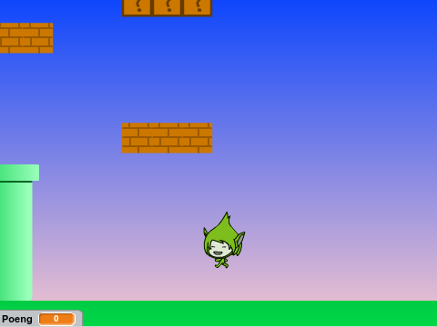

# Introduksjon {.intro}

Før Super Mario fikk sine egne spill het han Jumpman. I dette
prosjektet skal vi lage et Super Mario-lignende plattformspill. Det er
ganske involvert, og vi vil derfor dele opp prosjektet i fire deler
som til sammen blir et spennende spill.

I denne tredje delen skal vi se hvordan vi kan lage verdenen vår
større ved å flytte ting på skjermen slik at det ser ut til at Jumpman
beveger seg.



# Oversikt over prosjektet {.activity}

Dette prosjektet består av 4 deler hvor vi stadig videreutvikler
spillet vårt.

+ I [del 1](jumpman_1_animasjon.html) programmerte vi helten vår,
  Jumpman, og spesielt animerte vi ham alt etter som om han stod i ro,
  løp eller hoppet.

+ I [del 2](jumpman_2_kollisjon.html) så vi hvordan vi kunne oppdage
  at Jumpman berørte forskjellige ting, og spesielt hvordan vi kunne se
  forskjellen på om han hoppet opp i en plattform eller stod på toppen
  av den.

+ I denne tredje delen skal vi utvide verdenen vår ved å flytte på
  bakgrunnen. Vi vil da kunne løpe rundt og oppdage plattformer
  utenfor skjermen.

+ I [fjerde og siste del](jumpman_4_design.html) vil vi lære hvordan
  vi lager flere nivåer, samt hvordan vi kan inkludere elementer som
  smarte fiender og bevegelige plattformer.

# Steg 1: Posisjon, posisjon, posisjon {.activity}

Vi skal nå flytte bakgrunnen i spillet vårt slik at det ser ut til at Jumpman
beveger seg. Det vil gi oss muligheten til å lage en verden som er større enn
skjermen!

## Sjekkliste {.check}

+ Hent i Jumpman-spillet som du laget i [del 1](jumpman_1_animasjon.html) og
  [del 2](jumpman_2_kollisjon.html). Vi skal fortsette på dette (du kan også
  velge `Lagre som kopi` fra filmenyen om du vil ta vare på hvordan spillet ditt
  ser ut etter de to første delene).

+ For å kunne flytte på bakgrunnen må alle elementene i bakgrunnen være egne
  figurer. Om du har tegnet noe rett på bakgrunnen på scenen må du derfor lage
  nye figurer som tilsvarer dette. Husk å gi disse figurene `sjekk
  sensor`-skript slik at Jumpman oppfører seg riktig når han berører dem.

Den siste forberedelsen vår er at vi må kunne tenke på posisjonen til Jumpman på
to forskjellige måter: hvor han er på skjermen og hvor han er i verden. Så langt
har vi vist hele verden på skjermen slik at disse har vært de samme. Nå må vi
dele dem opp. Hvor Jumpman er på skjermen kontrollerer vi med `(x-posisjon)`{.b}
og `(y-posisjon)`{.b}, men for å kontrollere hvor han er i verden trenger vi
noen nye variabler:

+ Legg til variablene `(posX)`{.b} og `(posY)`{.b} på `Kontroller`. Det er
  veldig viktig at disse gjelder _kun for denne figuren_.

+ Nå skal vi bruke disse nye variablene. Endre `flytt figurer`-skriptet til
  `Kontroller` slik:

  ```blocks
      når jeg mottar [flytt figurer v]
      endre [posX v] med (fartX)
      endre [posY v] med (fartY)
      sett x til (posX)
      sett y til (posY)
  ```

+ Bytt også alle `endre x med ()`{.b}- og `endre y med ()`{.b}-klosser med
  tilsvarende `endre [posX v] med ()`{.b}- og `endre [posY v] med
  ()`{.b}-klosser i andre skript i `Kontroller`-figuren (det er ikke sikkert du
  har noen).

+ Om du tester ditt spillet ditt skal det fungere på samme måte som
  tidligere. Vi har bare forberedt oss for neste steg.

# Steg 2: Kamera {.activity}

For å flytte bakgrunnen tenker vi oss at vi har et kamera som vi kan flytte
eller peke på forskjellige steder av verdenen vår. Dette implementerer vi ved
hjelp av to nye variabler:

## Sjekkliste {.check}

+ Legg til to nye variabler, `(kameraX)`{.b} og `(kameraY)`{.b}. Disse
  variablene må gjelde _for alle figurer_ siden alle figurene må vite hvor
  kameraet peker.

+ Legg også til en ny melding i hovedløkken på Scenen. La klossen `send melding
  [oppdater kamera v]`{.b} ligge nest-nederst, rett før `vis
  animasjon`-meldingen.

+ Endre nå de to nederste klossene i `flytt figurer`-skriptet på `Kontroller`
  (som du jobbet med i Steg 1):

  ```blocks
      sett x til ((posX) - (kameraX))
      sett y til ((posY) - (kameraY))
  ```

  Dette betyr at vi plasserer Jumpman på skjermen _relativt_ til hvor kameraet
  peker.

+ Vi kan nå begynne å flytte kameraet. Vi vil at det skal følge Jumpman rundt i
  verdenen. En måte å gjøre dette på er å bare sette `(kamera)`{.b}-variablene
  lik `(pos)`{.b}-variablene, men vi kan gjøre bevegelsen litt mykere på denne
  måten:

  ```blocks
      når jeg mottar [oppdater kamera v]
      endre [kameraX v] med (((posX) - (kameraX)) / (5))
      endre [kameraY v] med (((posY) - (kameraY)) / (5))
  ```

  Om du prøver spillet ditt nå vil det se ut til å ikke virke lenger. Det er
  fordi bare Jumpman vet om kameraet.

+ Gå til `Murstein`-figuren. Legg til `(posX)`{.b}- og `(posY)`{.b}-variabler
  som gjelder _kun for denne figuren_.

+ Bytt ut alle blå `sett :: motion`{.b}- og `endre :: motion`{.b}-klosser med
  tilsvarende oransje `sett [ v] til []`{.b}- `endre [ v] med ()`{.b}-klosser
  hvor du bruker `(posX)`{.b} og `(posY)`{.b}-variablene.
 
+ Lag et nytt `vis animasjon`-skript på `Murstein`:

  ```blocks
      når jeg mottar [vis animasjon v]
      sett x til ((posX) - (kameraX))
      sett y til ((posY) - (kameraY))
  ```

+ Test spillet ditt igjen. Nå skal mursteinene flytte på seg når Jumpman beveger
  seg!

# Steg 3: Alt flytter på seg {.activity}

Vi skal snart la alt flytte på seg, men først en liten forbedring.

## Sjekkliste {.check}

+ Prøv spillet ditt. Gå til høyre helt til mursteinene forsvinner ut på venstre
  side av skjermen. Ser du noe rart? Mursteinene forsvinner ikke helt!

  Dette er fordi Scratch antar at vi faktisk vil vise alle figurene våre, og den
  passer derfor på at figurene ikke blir helt borte. Men nå vil vi jo at
  mursteinene skal bli borte! Vi må derfor skjule dem selv. Endre `vis
  animasjon`-skriptet som du nettopp laget:

  ```blocks
      når jeg mottar [vis animasjon v]
      hvis <<([abs v] av ((posX) - (kameraX))) < [240]> og <([abs v] av ((posY) - (kameraY))) < [180]>>
          sett x til ((posX) - (kameraX))
          sett y til ((posY) - (kameraY))
          vis
      ellers
          skjul
      slutt
  ```

  Du kjenner kanskje igjen tallene 240 og 180? Disse representerer størrelsen på
  skjermen. For eksempel sier vi at dersom `(x-posisjon)`{.b} blir mindre enn
  -240 eller større enn 240 skal vi skjule figuren.

+ Kopier dette `vis animasjon`-skriptet til andre figurer du vil at skal flytte
  på seg, for eksempel `Fruktsalat` om du laget denne i
  [del 2](jumpman_2_kollisjon.html). Kopieringen gjør også at `(posX)`{.b} og
  `(posY)`{.b}-variabler lages automatisk for disse andre figurene.

+ Oppdater alle blå klosser til oransje for disse figurene på samme måte som vi
  gjorde for `Murstein` på slutten av Steg 2.

# Steg 4: Videreutvikling av spillet {.activity}

*Nå som vi kan skrolle bakgrunnen er enda en av hovedkomponentene i spillet vårt
 på plass. I den [siste delen](jumpman_4_design.html) av oppgaven skal vi se mer
 på hvordan vi kan designe flere nivå, bevegelige plattformer og smarte
 fiender. Nedenfor er forslag til ting du kan gjøre før du gyver løs på neste
 del.*

## Ideer til videreutvikling {.check}

+ Utvid verdenen din! Bygg mursteiner og andre figurer som starter utenfor
  skjermen slik at du må bevege Jumpman for å finne dem.

+ Du kan begrense hvordan kameraet flytter på seg ved å endre koden på `oppdater
  kamera`-skriptet. For eksempel vil denne koden hindre Jumpman i å gå for langt
  til venstre:

  ```blocks
      hvis <<(posX) > [0]> eller <(kameraX) > [0]>>
          endre [kameraX v] med (((posX) - (kameraX)) / (5))
      slutt
  ```

+ Du kan også prøve med et kamera som flytter seg automatisk, og deretter si at
  om ikke Jumpman klarer å holde følge med kameraet så er spillet slutt.

+ Lag nye spennende ting Jumpman kan finne inne i mursteiner. For eksempel kan
  du lage en kanon-figur som kan skyte Jumpman over skjermen! Denne kan du
  implementere ved å teste om for eksempel mellomromstasten er trykket og
  Jumpman berører kanonen. I såfall kan du sette `(fart)`{.b}-variablene til
  Jumpman til ganske store tall og spille en passende kaboom-lyd!

