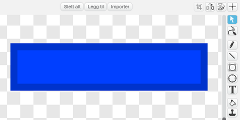
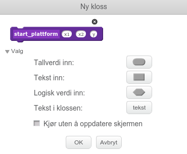

# Introduksjon {.intro}

Før Super Mario fikk sine egne spill het han Jumpman. I dette
prosjektet skal vi lage et Super Mario-lignende plattformspill. Det er
ganske involvert, og vi vil derfor dele opp prosjektet i fire deler
som til sammen blir et spennende spill.

I denne fjerde og siste delen vil vi se hvordan vi kan implementere
flere nivåer i spillet, samt hvordan vi designer spennende elementer
som smarte fiender og bevegelige plattformer.


# Oversikt over prosjektet {.activity}

Dette prosjektet består av 4 deler hvor vi stadig videreutvikler
spillet vårt.

+ I [del 1](jumpman_1_animasjon.html) programmerte vi helten vår,
  Jumpman, og spesielt animerte vi ham alt etter som om han stod i ro,
  løp eller hoppet.

+ I [del 2](jumpman_2_kollisjon.html) så vi hvordan vi kunne oppdage
  at Jumpman berørte forskjellige ting, og spesielt hvordan vi kunne se
  forskjellen på om han hoppet opp i en plattform eller stod på toppen
  av den.

+ I [del 3](jumpman_3_skrolling.html) utvidet vi verdenen vår ved å
  flytte på bakgrunnen. Vi kunne da løpe rundt og oppdage plattformer
  utenfor skjermen.

+ I denne fjerde og siste delen vil vi lære hvordan vi lager flere
  nivåer, samt hvordan vi kan inkludere elementer som smarte fiender
  og bevegelige plattformer.

# Steg 1: Flere nivåer {.activity}

*La oss først se hvordan vi kan lage flere brett eller nivåer i spillet vårt.*

## Sjekkliste {.check}

+ Hent inn Jumpman-spillet som du har programmert i
  [del 1](jumpman_1_animasjon.html), [del 2](jumpman_2_kollisjon.html) og
  [del 3](jumpman_3_skrolling.html).

+ Lag en variabel som gjelder _for alle figurer_. La den hete `(nivå)`{.b} og
  den kan godt være synlig på skjermen om du vil det.

+ Lag så et mål i spillet ditt om du ikke har det allerede. Dette kan være for
  eksempel en skatt man må finne (kanskje den er gjemt inne i en murstein?)
  eller som i første brettet på Super Mario, et flagg man må nå og heise opp.

  La denne figuren øke `(nivå)`{.b} og sende meldingen `avslutt brett` når den
  blir funnet. For eksempel,

  ```blocks
  når jeg mottar [sjekk plattform v]
  hvis <berører [Kontroller v]>
      endre [nivå v] med (1)
      send melding [avslutt brett v]
      slett denne klonen
  slutt
  ```

+ Vi må nå passe på at vi sletter alle kloner når et brett avsluttes. Legg
  derfor et lite skript på alle figurer som lager kloner, som `slett denne
  klonen`{.b} etter `når jeg mottar [avslutt brett v]`{.b}.

+ Vi skal nå flytte litt rundt på skriptene på Scenen slik at vi kan starte
  forskjellige brett.

  ```blocks
  når jeg mottar [nytt spill v]
  sett [nivå v] til [1]
  send melding [nytt brett v]

  når jeg mottar [nytt brett v]
  send melding (sett sammen [start nivå ] (nivå))
  for alltid
      send melding [oppdater sensor v]
      send melding [sjekk sensor v]
      send melding [fysikk v]
      send melding [sjekk plattform v]
      send melding [sjekk tastetrykk v]
      send melding [flytt figur v]
      send melding [oppdater kamera v]
      send melding [vis animasjon v]
  slutt
  ```

  Pass på at det skal være et mellomrom etter `start nivå ` for at vi skal kunne
  motta meldinger av typen `start nivå 1` og `start nivå 2`, avhengig av verdien
  av nivå.

+ Legg et `avslutt brett`-skript på Scenen også. Dette skal avslutte
  hovedløkken, og deretter starte den på nytt:

  ```blocks
  når jeg mottar [avslutt brett v]
  stopp [andre skript på scenen v] :: control
  vent (1) sekunder
  send melding [nytt brett v]
  ```

+ Siden vi byttet ut `send melding [startposisjon v]`{.b} med `send melding
  (sett sammen [start nivå ] (nivå))`{.b} må vi oppdatere `når jeg mottar
  [startposisjon v]`{.b}-klossene også. Endre disse til

  ```blocks
  når jeg mottar [start nivå 1 v]
  ```

  på alle figurene.

+ Om du prøver spillet ditt igjen nå skal det fungere omtrent slik det gjorde
  tidligere. Det nye er at nå har du muligheten til å designe flere brett!

  Lag nye brett ved å lage `når jeg mottar [start nivå 2 v]`{.b} og tilsvarende
  klosser på de forskjellige figurene hvor du forteller hvordan brettene skal se
  ut.

# Steg 2: Bevegelige plattformer {.activity}

*Hvordan kan vi lage plattformer som beveger seg, og som flytter Jumpman også?*

## Sjekkliste {.check}

+ Tegn en ny figur som kan fungere som en plattform. Denne kan gjerne være et
  ganske avlangt rektangel:

  

+ Kopier `sjekk_sensor`- og `vis_animasjon`-skriptene fra for eksempel
  `Murstein` til plattform-figuren, siden disse vil være omtrent identiske.

+ For å få plattformene til å bevege seg trenger vi tre nye variabler. Legg til
  `(startX)`{.b}, `(sluttX)`{.b} og `(fartX)`{.b} og pass på at de gjelder kun
  _for denne figuren_.

+ Vi må sette verdien av disse variablene for hver plattform vi vil lage. La oss
  derfor lage en ny kloss som gjør dette for oss. Gå til `Flere
  klosser`{.blockmoreblocks}-kategorien, og `Lag en kloss`.

  Lag en kloss som heter `start plattform`{.blockmoreblocks} og under `Valg`
  legger du til tre felter for _Tallverdi inn_. Kall disse feltene `x1`, `x2` og
  `y`.

  

+ Definer klossen som følger:

  ```blocks
  definer start plattform (x1) (x2) (y)
  sett [posX v] til (x1)
  sett [posY v] til (y)
  sett [startX v] til (x1)
  sett [sluttX v] til (x2)
  sett [fartX v] til [2]
  lag klon av [meg v]
  ```

+ Du kan nå lage plattformer ved å bruke denne nye klossen. For eksempel,

  ```blocks
  når jeg mottar [start nivå 1 v]
  start plattform (100) (300) (-50) :: custom
  ```

+ For at plattformen skal flytte på seg må vi skrive et skript på `flytt figur`-meldingen:

  ```blocks
  når jeg mottar [flytt figur v]
  endre [posX v] med (fartX)
  hvis <<(posX) < (startX)> eller <(posX) > (sluttX)>>
      sett [fartX v] til ((-1) * (fartX))
  slutt
  ```

  Denne passer også på at plattformen snur når den kommer til `(sluttX)`{.b}.

+ Om du tester spillet ditt nå skal plattformen bevege seg, men Jumpman sklir
  bare av plattformen i stedet for å følge med. Hvordan kan vi få ham til å
  følge plattformen?

  Vi innfører en ny variabel. Denne skal gjelde _for alle figurer_ og kan hete
  `(plattform - fartX)`{.b}. Den skal si hvor mye vi må flytte Jumpman på grunn
  av plattformer.

+ Inne i testen `hvis <berører [Sensor - Fot v]?>`{.b} kan du også legge til
  klossen `sett [plattform - fartX v] til (fartX)`{.b}, mens du legger til et
  skript for å nullstille farten om ikke Jumpman står på plattformen:

  ```blocks
  når jeg mottar [oppdater sensor v]
  sett [plattform - fartX v] til [0]
  ```

+ Til slutt legger vi på denne farten til farten Jumpman allerede har. Gå til
  `Kontroller` og endre `endre [posX v] med (fartX)`{.b} i `flytt
  figurer`-skriptet til

  ```blocks
  endre [posX v] med ((fartX) + (plattform - fartX))
  ```

## Prøv selv {.try}

+ Vi har nå laget plattformer som beveger frem og tilbake. Kan du lage
  plattformer som kan bevege seg opp og ned? Du må stort sett gjøre det samme
  som over, men med `Y` i stedet for `X`.

# Steg 3: Skumle fiender {.activity}

*Til sist skal vi se på noen skumle fiender som prøver å ta oss. Men om vi bare
 hopper på hodet deres går det nok bra!*

## Sjekkliste {.check}

+ Fiender oppfører seg faktisk ganske likt plattformer. De vil også bevege seg
  frem og tilbake. Forskjellen er at i stedet for å følge etter om vi er borti
  en fiende skal vi tape spillet.

  Lag en ny fiendefigur. Tegn denne gjerne selv.

+ Følg de samme stegene som for plattformen slik at fienden beveger seg frem og
  tilbake. Det vil si at du må kopiere `sjekk_sensor`- og
  `vis_animasjon`-skriptene, lage nye variabler, definere en ny `start
  fiende`{.blockmoreblocks}-kloss og lage et `flytt_figur`-skript.

+ For å sjekke om fienden tar oss kan vi endre på `sjekk sensor`-skriptet. Om du
  for eksempel skriver

  ```blocks
  når jeg mottar [sjekk sensor v]
  hvis <berører [Sensor - fot v]?>
      sett [sensor - fot v] til [ja]
      slett denne klonen
  ellers
      hvis <berører [Sensor - hode v]?>
          send melding [tap v]
      slutt
      hvis <berører [Sensor - venstre v]?>
          send melding [tap v]
      slutt
      hvis <berører [Sensor - høyre v]?>
          send melding [tap v]
      slutt
  slutt
  ```

  vil vi kunne fjerne fienden ved å hoppe på ham (vi berører ham med foten),
  mens vi taper om han berører oss på de andre sensorene først.

+ Lag en effekt om meldingen `tap` blir sendt. La gjerne denne sende meldingen
  `avslutt brett` etterpå slik at brett blir ryddet opp.

# Steg 4: Videreutvikling av spillet {.activity}

*Om du har gjort alle delene har du nå et ganske avansert spill! Forhåpentligvis
 har du fortsatt litt oversikt over hvordan ting henger sammen slik at du kan
 fortsette å utvikle spillet ditt slik du ønsker!*

## Ideer til videreutvikling {.check}

+ Du kan videreutvikle dette spillet på mange måter: Flere animasjoner! Flere
  typer mursteiner og ting gjemt inne i mursteinene! Flere fiender! Flere
  nivåer! Bruk fantasien!

+ Legg på spennende lydeffekter. Husk at du kan ta opp dine egne lyder også, du
  trenger ikke bare bruke lydene som er i Scratch-biblioteket.

+ Lag en intro til spillet, som forteller hva det handler om. Kanskje du kan
  lage en liten animasjon som vises når man starter spillet?

+ Tell liv. Det er jo alltid kjedelig å måtte begynne spillet helt på nytt om
  man er uheldig og blir fanget av en fiende. Kanskje man bare kan miste et liv,
  men fortsette spillet omtrent der man tapte?

+ Ta tiden! Hva med å legge inn en tidsbegrensning på hvert nivå? Dette kan du
  gjøre med en ny `(tid)`{.b}-variabel.

Husk også på at du kan velge å ta med deler av dette spillet i dine andre
spill. Kanskje vil du ha med litt animasjon eller bakgrunnsskrolling. Nå vet du hvordan!

<!-- # Oppsummering {.activity} -->

