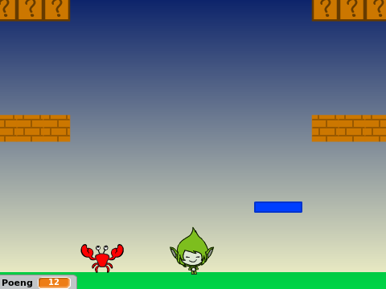

# Introduksjon {.intro}

Før Super Mario fikk sine egne spill het han Jumpman. I dette
prosjektet skal vi lage et Super Mario-lignende plattformspill. Det er
ganske involvert, og vi vil derfor dele opp prosjektet i fire deler
som til sammen blir et spennende spill.

I denne fjerde og siste delen vil vi se hvordan vi kan implementere
flere nivåer i spillet, samt hvordan vi designer spennende elementer
som smarte fiender og bevegelige plattformer.

# Oversikt over prosjektet {.activity}

Dette prosjektet består av 4 deler hvor vi stadig videreutvikler
spillet vårt.

+ I [del 1](jumpman_1_animasjon.html) programmerte vi helten vår,
  Jumpman, og spesielt animerte vi ham alt etter som om han stod i ro,
  løp eller hoppet.

+ I [del 2](jumpman_2_kollisjon.html) så vi hvordan vi kunne oppdage
  at Jumpman berørte forskjellige ting, og spesielt hvordan vi kunne se
  forskjellen på om han hoppet opp i en plattform eller stod på toppen
  av den.

+ I [del 3](jumpman_3_skrolling.html) utvidet vi verdenen vår ved å
  flytte på bakgrunnen. Vi kunne da løpe rundt og oppdage plattformer
  utenfor skjermen.

+ I denne fjerde og siste delen vil vi lære hvordan vi lager flere
  nivåer, samt hvordan vi kan inkludere elementer som smarte fiender
  og bevegelige plattformer.
